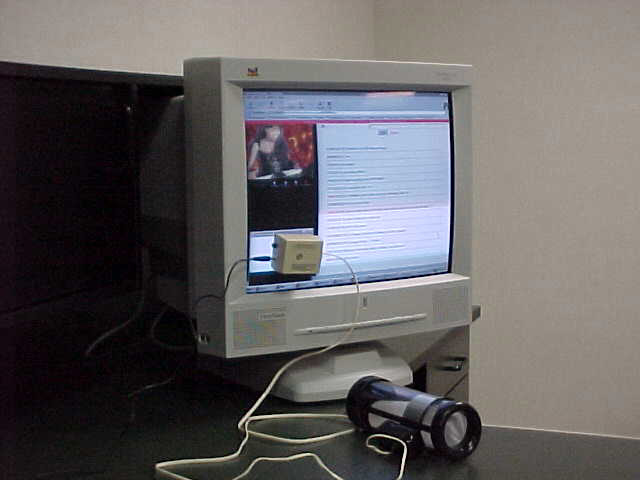
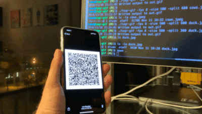

# What is QRTuber?

QRTuber is a strategy for sending small chunks of data, synchronized with a video, by encoding a QRCode into the video. While it has been made with video game streaming in mind, there are most likely many potential scenarios the system could be used in.

Some potential uses include:

- Synchronizing gamepad rumble from a streamer's gameplay recording
- Controlling systems such as home lighting based on streamed game events.
  - For instance, making lights flicker in relation to game events relayed from a horror game
- Sending game controls from a streamer to a viewer, for synchronizing gameplay
  - For instance, a streamer could speedrun a game and the controls can be relayed to a local emulator of a viewer ([thanks to Jaku of Crowd Control for this idea](https://crowdcontrol.live))

At the moment, QRTuber is considered at the pre-alpha proof-of-concept stage, and only supports communication with [Intiface Central](https://intiface.com/central) for relaying haptics commands to various devices. Support for different hardware and setups will hopefully expand as the system matures.

## How it works, in theory

The workflow behind QRTuber from a high level is as follows:

- A streamer, using a streaming service (be it twitch, youtube, fansly, joystick, doesn't matter as
  long as there's a video element available), plays a video game. The video game will require some
  sort of mod to exfiltrate game state in a way that can be accessed from outside the game process.
- Another program picks up the exfiltrated game state, and turns that information into a QRCode
  containing a condensed version of the information.
  - The data packed into the QR code will have 2 sections: A 16-bit format identifier, followed by
    an arbitrary amount of data. Data length should be minimized to reduce QRCode complexity.
- The generated QRCode is displayed as a Browser Overlay in a streaming application like OBS.
  - As most streaming is at least 1080p, the QRCode does not need to take up a large portion of the
    screen.
- A viewer watching the stream uses some method to monitor the video element of the stream they are
  watching and extract the QRCode data.
  - Currently, this can be a Web Browser Extension, a WebRTC screen capture system, or a user
    script.
  - QRCode decoding has been found to be quite performant as long as the QRCode is not moved around
    the screen. Using WASM for decoding, average decode frequency (once a QRCode is found in a frame) can be up to 60hz, though we recommend expecting about 20hz due to various reasons. There is more discussion of this in the developer section of the documentation.
- Data taken from the QRCode is read, and relayed to an outside program to cause some sort of event
  to happen, based on the data type.

## How it works, in practice

To concretize the product vision, here's an explanation of how QRTuber can be used with already
existing programs. In this case, relaying a streamer's gamepad rumble signals from a game to a viewer.

- A streamer plays a video game that has Gamepad rumble available, and uses the [Intiface Game
  Haptics Router](https://intiface.com/ghr) to reroute rumble commands out of the game to [Intiface Central](https://intiface.com/central).
- In [Intiface Central](https://intiface.com/central), a _websocket device_ is created, which
  simualtes a hardware device normally supported by Central. This _websocket device_ is actually a webpage with javascript, using a websocket connection to Intiface Central to receive commands and convert them into a QRTuber-compatible QRCode.
- This QRCode is displayed as a Browser Overlay in OBS, and is included in the streamer's video on
  whatever streaming service they're using.
- Viewers of the stream install the QRTuber Web Browser Extension, which reads the QRCode in real
  time during stream/video playback. The extension talks directly to the viewer's copy of Intiface Central, which can control rumble in an XBox Compatible Gamepad. This allows the viewer to feel similar (but not exact) rumble to what the streamer is feeling, in time with the events of the stream.

## Why QRTuber?

Screen real-estate for streaming is expensive, as space may be needed for widgets, game viewing, or other features. Even so, we believe encoding QR Code data into the video has several advantages that make it worth the cost.

Relaying arbitrary synchronized data through video streams is possible using MPEG4 data channels
encoded into MP4 files. However, most streaming services re-encode video for broadcast. The streamer
does not have control over the final data channels delivered to the viewer, nor do they have any say
over how the viewer actually views the video, how much buffering is happening, etc... QRTuber allows
a streamer to encode enough data to do simple operations, in a way that is synchronized with the
streamer's actions in a game or other situations.

While synchronized hardware control formats for videos have existed for many years (see the Inspriations section below for examples), they usually require extra files to exist alongside a video file, and specialized players to parse them and work with the related commands. QRTuber alleviates this by directly encoding data into videos, meaning that recordings and Video-On-Demand (VOD) viewing does not require any extra software in order to replay events. The data is already available in the recorded video.

The choice of QR Codes for QRTuber came out of experimentation. The original plan for QRTuber was to use simpler, 2-color AR fiducials markers (like ArUco) along with color changing to relay ~1-2 bytes of information (varying color of 2 of 3 RGB channels and reading that out as data). However, on testing, it was found that QRCode finding and decoding was fast enough, and gives us the ability to encode far more data.

Bandwidth is definitely a limitation of QRTuber. For instance, in the How It Works In Practice section above, the viewer will only feel a similar rumble experience to what the streamer does. This is because gamepad rumble can update much faster than the ~20hz we can expect from QRTuber. That said, we do not expect QRTuber to be a 1:1 relay of experience. Rather, the best outcome will be **enough to make things basically work** but no more. QRTuber is not made to be a system to carry large amounts of information in any sort of high bandwidth or reliable fashion, nor is it expected to be used as such. **Long story short: don't try anything that requires guarenteed timing or delivery of updates with QRTuber.**

## Inspirations for creating QRTuber

QRTuber was created based on various ideas I've run into over the years. They're included here to give users and develoeprs a better idea of how this project came about.

### Safesex Plus and Early Adult Novelty Hardware Video Sync

Video-to-hardware synchronization has existed for adult hardware since the mid-late 1990's. One of the first devices available was the SafeSexPlus Robosuck, a stroking device that varied its speed based on video control. Instead of using serial or early USB connections, the device came with a photodiode encased in a suction cup. This suction cup would be attached to a CRT monitor in a specific position on the screen. When a video made for the device was played back, the designated portion of the screen would move from black to white. This variance in light levels would be picked up by the photodiode and translated to movement within the device.

QRTuber is a very similar idea to this. Instead of requiring outside hardware, we can now just pull frames from video feeds and use classical CV methods for reading out data from the QR Code, allowing us to provide a pure software solution. Sometimes the technological advances of the past 25 years end up being helpful.

### VRChat Furality Clubs and Video Texture Synchronization

<iframe width="400" height="225" src="https://www.youtube.com/embed/sY5MyqvgmhE?si=9pRsvXxgP6YYssc2" title="YouTube video player" frameborder="0" allow="accelerometer; autoplay; clipboard-write; encrypted-media; gyroscope; picture-in-picture; web-share" referrerpolicy="strict-origin-when-cross-origin" allowfullscreen></iframe>

A common tactic in lighting systems for clubs in virtual worlds such as VRChat is to use specially encoded, subdivided textures. These textures are transmitted in world, then divided into sections for lighting manipulation and display. Systems like this are even available open source, such as the [VR Stage Lighting project on Github](https://github.com/AcChosen/VR-Stage-Lighting).

QRTuber uses a similar idea for encoding controls into video. However, as QRTuber may be used by anyone (and therefore the code may always be in a different place on the screen), we don't have the luxury of knowing exactly what portions of video to extract in order to find data. This is why we use a fiducial marker that also contains the data, so that we can do arbitrary lookup quickly.

### TXQR

[TXQR](https://github.com/divan/txqr) is a project using [animated QRCodes](https://divan.dev/posts/animatedqr/) and [LT/fountain codes](https://divan.dev/posts/fountaincodes/) as a peer-to-peer file transfer mechanism between devices with cameras. It provides a standardized way to move files in a local, privacy preserving way.

The TXQR blog posts and project were massively helpful in understanding requirements around QRCode data transfer for QRTuber.

### Rumbling Universal Mayhem Plugin (RUMP)

<iframe width="400" height="225" src="https://www.youtube.com/embed/mtUdh7U_bQM?si=Jf7gM_PQYq_YIXQ4" title="YouTube video player" frameborder="0" allow="accelerometer; autoplay; clipboard-write; encrypted-media; gyroscope; picture-in-picture; web-share" referrerpolicy="strict-origin-when-cross-origin" allowfullscreen></iframe>

[Rumbling Universal Mayhem Plugin (RUMP)](https://renpona.itch.io/rumbling-universal-mayhem-plugin) uses [Intiface Central](https://intiface.com/central) and the various game mods available for Intiface to relay game events to Vtuber avatars. This allows streamers a way to automate their Vtuber reaction systems while playing games.

QRTuber is a direct result of the release of RUMP, as that project using Intiface outside of its normal context made me think about how to flip the data transfer relationship and use game events in streaming to also transfer data to users.